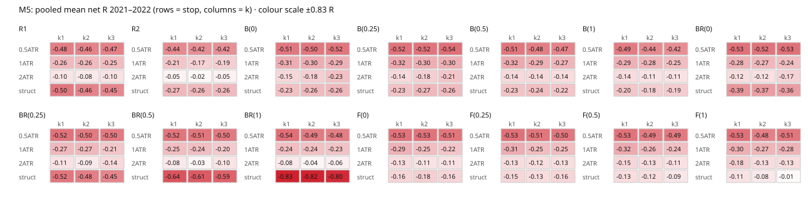
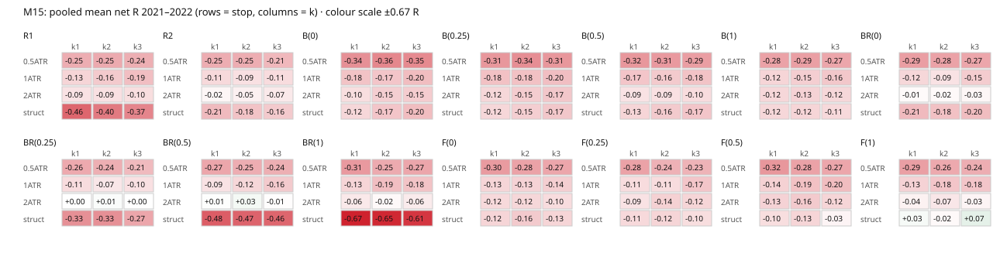

# Edge Discovery Lab — Phase F5 report (previous New York close level)

**Verdict: `F5_STOP`**

Generated 2026-09-30T16:38:04+00:00 · F1 config fingerprint `7e945e717983b088` · 336 configurations · 200 direction-flip permutations (reality check on the maximum)

## Data

- M1 rows 884546; days 645; quarantined 4; days with a level 640
- `xauusd_m1_2020.csv.gz` SHA-256 `00ca2cf04db683893907c9eb5eac5468c83d68803703b58fe4b05d0cdac22130`
- `xauusd_m1_2021.csv.gz` SHA-256 `e5e34c796775ecbb7f32195515191ccc3a88c5a893082f5666ad84df55cfbe21`
- `xauusd_m1_2022.csv.gz` SHA-256 `78c5141f34a6de8e2badaa6c81bf3a2b8a303c98869d8cf9b1ae61e3836d1516`

Best configuration under direction flips (mean net R 2021–2022): median 0.055, 90% 0.108, 95% 0.122.

## Heatmaps: pooled mean net R 2021–2022 (rows = stop, columns = k)

### M5 — 

| Variant | Stop | k1 | k2 | k3 |
|---|---|---|---|---|
| R1 | 0.5 ATR | -0.480 | -0.465 | -0.474 |
|  | 1 ATR | -0.256 | -0.261 | -0.250 |
|  | 2 ATR | -0.098 | -0.082 | -0.104 |
|  | struct | -0.505 | -0.463 | -0.448 |
| R2 | 0.5 ATR | -0.437 | -0.416 | -0.417 |
|  | 1 ATR | -0.214 | -0.173 | -0.186 |
|  | 2 ATR | -0.049 | -0.022 | -0.055 |
|  | struct | -0.269 | -0.264 | -0.256 |
| B(0) | 0.5 ATR | -0.511 | -0.503 | -0.518 |
|  | 1 ATR | -0.310 | -0.304 | -0.291 |
|  | 2 ATR | -0.153 | -0.180 | -0.234 |
|  | struct | -0.230 | -0.261 | -0.263 |
| B(0.25) | 0.5 ATR | -0.523 | -0.524 | -0.536 |
|  | 1 ATR | -0.320 | -0.301 | -0.300 |
|  | 2 ATR | -0.142 | -0.180 | -0.214 |
|  | struct | -0.227 | -0.267 | -0.256 |
| B(0.5) | 0.5 ATR | -0.512 | -0.485 | -0.467 |
|  | 1 ATR | -0.318 | -0.287 | -0.272 |
|  | 2 ATR | -0.141 | -0.140 | -0.136 |
|  | struct | -0.228 | -0.242 | -0.217 |
| B(1) | 0.5 ATR | -0.487 | -0.444 | -0.420 |
|  | 1 ATR | -0.289 | -0.276 | -0.247 |
|  | 2 ATR | -0.135 | -0.109 | -0.110 |
|  | struct | -0.204 | -0.183 | -0.191 |
| BR(0) | 0.5 ATR | -0.528 | -0.522 | -0.528 |
|  | 1 ATR | -0.281 | -0.270 | -0.242 |
|  | 2 ATR | -0.123 | -0.115 | -0.166 |
|  | struct | -0.393 | -0.367 | -0.364 |
| BR(0.25) | 0.5 ATR | -0.521 | -0.501 | -0.502 |
|  | 1 ATR | -0.269 | -0.267 | -0.211 |
|  | 2 ATR | -0.108 | -0.085 | -0.141 |
|  | struct | -0.516 | -0.478 | -0.454 |
| BR(0.5) | 0.5 ATR | -0.518 | -0.512 | -0.501 |
|  | 1 ATR | -0.249 | -0.245 | -0.203 |
|  | 2 ATR | -0.083 | -0.030 | -0.101 |
|  | struct | -0.641 | -0.611 | -0.589 |
| BR(1) | 0.5 ATR | -0.537 | -0.489 | -0.482 |
|  | 1 ATR | -0.240 | -0.235 | -0.227 |
|  | 2 ATR | -0.082 | -0.035 | -0.059 |
|  | struct | -0.831 | -0.824 | -0.801 |
| F(0) | 0.5 ATR | -0.525 | -0.527 | -0.514 |
|  | 1 ATR | -0.287 | -0.250 | -0.217 |
|  | 2 ATR | -0.134 | -0.112 | -0.111 |
|  | struct | -0.160 | -0.179 | -0.160 |
| F(0.25) | 0.5 ATR | -0.532 | -0.512 | -0.503 |
|  | 1 ATR | -0.306 | -0.250 | -0.245 |
|  | 2 ATR | -0.135 | -0.123 | -0.127 |
|  | struct | -0.147 | -0.134 | -0.156 |
| F(0.5) | 0.5 ATR | -0.527 | -0.489 | -0.495 |
|  | 1 ATR | -0.316 | -0.259 | -0.242 |
|  | 2 ATR | -0.146 | -0.130 | -0.113 |
|  | struct | -0.129 | -0.124 | -0.092 |
| F(1) | 0.5 ATR | -0.530 | -0.475 | -0.512 |
|  | 1 ATR | -0.301 | -0.273 | -0.283 |
|  | 2 ATR | -0.183 | -0.132 | -0.130 |
|  | struct | -0.111 | -0.085 | -0.015 |

### M15 — 

| Variant | Stop | k1 | k2 | k3 |
|---|---|---|---|---|
| R1 | 0.5 ATR | -0.249 | -0.251 | -0.241 |
|  | 1 ATR | -0.126 | -0.159 | -0.193 |
|  | 2 ATR | -0.089 | -0.095 | -0.100 |
|  | struct | -0.458 | -0.400 | -0.367 |
| R2 | 0.5 ATR | -0.247 | -0.247 | -0.215 |
|  | 1 ATR | -0.112 | -0.092 | -0.106 |
|  | 2 ATR | -0.024 | -0.048 | -0.065 |
|  | struct | -0.205 | -0.179 | -0.159 |
| B(0) | 0.5 ATR | -0.336 | -0.362 | -0.353 |
|  | 1 ATR | -0.182 | -0.170 | -0.198 |
|  | 2 ATR | -0.099 | -0.146 | -0.154 |
|  | struct | -0.119 | -0.171 | -0.197 |
| B(0.25) | 0.5 ATR | -0.314 | -0.339 | -0.312 |
|  | 1 ATR | -0.184 | -0.184 | -0.195 |
|  | 2 ATR | -0.117 | -0.153 | -0.167 |
|  | struct | -0.123 | -0.148 | -0.167 |
| B(0.5) | 0.5 ATR | -0.315 | -0.309 | -0.292 |
|  | 1 ATR | -0.172 | -0.162 | -0.180 |
|  | 2 ATR | -0.086 | -0.093 | -0.104 |
|  | struct | -0.126 | -0.161 | -0.172 |
| B(1) | 0.5 ATR | -0.280 | -0.286 | -0.266 |
|  | 1 ATR | -0.124 | -0.145 | -0.164 |
|  | 2 ATR | -0.118 | -0.131 | -0.121 |
|  | struct | -0.117 | -0.123 | -0.111 |
| BR(0) | 0.5 ATR | -0.295 | -0.278 | -0.265 |
|  | 1 ATR | -0.117 | -0.087 | -0.154 |
|  | 2 ATR | -0.015 | -0.021 | -0.029 |
|  | struct | -0.205 | -0.184 | -0.198 |
| BR(0.25) | 0.5 ATR | -0.260 | -0.239 | -0.208 |
|  | 1 ATR | -0.107 | -0.071 | -0.096 |
|  | 2 ATR | 0.002 | 0.011 | 0.003 |
|  | struct | -0.334 | -0.331 | -0.267 |
| BR(0.5) | 0.5 ATR | -0.268 | -0.249 | -0.241 |
|  | 1 ATR | -0.089 | -0.123 | -0.159 |
|  | 2 ATR | 0.009 | 0.035 | -0.005 |
|  | struct | -0.485 | -0.469 | -0.460 |
| BR(1) | 0.5 ATR | -0.309 | -0.254 | -0.268 |
|  | 1 ATR | -0.128 | -0.191 | -0.180 |
|  | 2 ATR | -0.064 | -0.022 | -0.060 |
|  | struct | -0.665 | -0.647 | -0.607 |
| F(0) | 0.5 ATR | -0.302 | -0.280 | -0.268 |
|  | 1 ATR | -0.129 | -0.132 | -0.145 |
|  | 2 ATR | -0.116 | -0.120 | -0.103 |
|  | struct | -0.124 | -0.159 | -0.129 |
| F(0.25) | 0.5 ATR | -0.280 | -0.235 | -0.227 |
|  | 1 ATR | -0.105 | -0.109 | -0.174 |
|  | 2 ATR | -0.090 | -0.140 | -0.125 |
|  | struct | -0.113 | -0.123 | -0.103 |
| F(0.5) | 0.5 ATR | -0.315 | -0.280 | -0.268 |
|  | 1 ATR | -0.142 | -0.187 | -0.199 |
|  | 2 ATR | -0.130 | -0.161 | -0.124 |
|  | struct | -0.099 | -0.126 | -0.033 |
| F(1) | 0.5 ATR | -0.286 | -0.257 | -0.244 |
|  | 1 ATR | -0.133 | -0.175 | -0.175 |
|  | 2 ATR | -0.043 | -0.072 | -0.034 |
|  | struct | 0.030 | -0.018 | 0.075 |

## Best 20 configurations by pooled mean net R

| Config | Trades 2021 / 2022 | Win % | Avg win R | Avg loss R | Mean R 2021 | Mean R 2022 | Mean R | Boot low R | p (RC) | Max DD R | Same-bar % | Result |
|---|---|---|---|---|---|---|---|---|---|---|---|---|
| `M15_F(1)_Sstruct_k3` | 134 / 124 | 37.2 | 1.69 | -0.88 | 0.057 | 0.094 | 0.075 | -0.068 | 0.290 | 15.0 | 0.0 |  |
| `M15_BR(0.5)_S2_k2` | 281 / 238 | 37.0 | 1.69 | -0.94 | -0.099 | 0.193 | 0.035 | -0.061 | 0.695 | 39.1 | 0.0 |  |
| `M15_F(1)_Sstruct_k1` | 143 / 125 | 51.1 | 0.88 | -0.86 | 0.129 | -0.083 | 0.030 | -0.061 | 0.765 | 17.2 | 0.7 |  |
| `M15_BR(0.25)_S2_k2` | 334 / 296 | 36.2 | 1.69 | -0.94 | -0.085 | 0.120 | 0.011 | -0.074 | 0.900 | 42.8 | 0.0 |  |
| `M15_BR(0.5)_S2_k1` | 301 / 247 | 50.0 | 0.95 | -0.94 | -0.022 | 0.046 | 0.009 | -0.058 | 0.920 | 29.5 | 0.4 |  |
| `M15_BR(0.25)_S2_k3` | 321 / 290 | 30.6 | 2.14 | -0.94 | -0.111 | 0.129 | 0.003 | -0.094 | 0.955 | 48.5 | 0.2 |  |
| `M15_BR(0.25)_S2_k1` | 370 / 323 | 49.8 | 0.96 | -0.94 | -0.026 | 0.035 | 0.002 | -0.056 | 0.955 | 25.7 | 0.3 |  |
| `M15_BR(0.5)_S2_k3` | 272 / 232 | 30.6 | 2.11 | -0.94 | -0.168 | 0.186 | -0.005 | -0.114 | 0.975 | 57.6 | 0.2 |  |
| `M15_BR(0)_S2_k1` | 469 / 396 | 48.8 | 0.96 | -0.94 | -0.015 | -0.015 | -0.015 | -0.066 | 0.990 | 31.2 | 0.2 |  |
| `M5_F(1)_Sstruct_k3` | 248 / 207 | 29.9 | 2.19 | -0.96 | -0.093 | 0.079 | -0.015 | -0.132 | 0.990 | 54.7 | 0.0 |  |
| `M15_F(1)_Sstruct_k2` | 134 / 124 | 38.4 | 1.37 | -0.88 | -0.018 | -0.018 | -0.018 | -0.140 | 0.990 | 17.8 | 0.4 |  |
| `M15_BR(0)_S2_k2` | 405 / 344 | 35.1 | 1.68 | -0.94 | -0.020 | -0.022 | -0.021 | -0.099 | 0.990 | 36.1 | 0.1 |  |
| `M15_BR(1)_S2_k2` | 178 / 160 | 34.9 | 1.68 | -0.93 | -0.160 | 0.131 | -0.022 | -0.140 | 0.990 | 37.5 | 0.0 |  |
| `M5_R2_S2_k2` | 742 / 685 | 34.0 | 1.83 | -0.98 | -0.057 | 0.015 | -0.022 | -0.081 | 0.990 | 69.8 | 0.1 |  |
| `M15_R2_S2_k1` | 539 / 501 | 48.8 | 0.95 | -0.95 | -0.039 | -0.008 | -0.024 | -0.074 | 0.990 | 38.1 | 0.1 |  |
| `M15_BR(0)_S2_k3` | 377 / 335 | 29.9 | 2.11 | -0.94 | -0.019 | -0.041 | -0.029 | -0.121 | 1.000 | 48.7 | 0.1 |  |
| `M5_BR(0.5)_S2_k2` | 450 / 399 | 33.3 | 1.86 | -0.98 | -0.034 | -0.025 | -0.030 | -0.109 | 1.000 | 46.0 | 0.1 |  |
| `M15_F(0.5)_Sstruct_k3` | 223 / 193 | 31.7 | 1.89 | -0.93 | -0.112 | 0.059 | -0.033 | -0.150 | 1.000 | 42.4 | 0.0 |  |
| `M15_F(1)_S2_k3` | 145 / 130 | 29.8 | 2.12 | -0.95 | -0.027 | -0.042 | -0.034 | -0.180 | 1.000 | 21.3 | 0.0 |  |
| `M5_BR(1)_S2_k2` | 305 / 261 | 33.4 | 1.83 | -0.97 | -0.086 | 0.025 | -0.035 | -0.130 | 1.000 | 40.8 | 0.2 |  |

## Splits of the best 5 (descriptive)

### `M15_F(1)_Sstruct_k3`
- approach: down (support): 115 trades, -0.035 R; up (resistance): 143 trades, 0.163 R
- test_no: 1: 169 trades, 0.151 R; 2: 74 trades, -0.082 R; 3: 15 trades, -0.012 R; 4+: 0 trades, — R
- session: 00-08: 93 trades, 0.130 R; 08-10: 28 trades, 0.444 R; 10-13: 38 trades, -0.079 R; 13-16:30: 40 trades, -0.062 R; 16:30-18: 34 trades, -0.077 R; 18-21:30: 25 trades, 0.115 R

### `M15_BR(0.5)_S2_k2`
- approach: down (support): 243 trades, 0.070 R; up (resistance): 276 trades, 0.003 R
- test_no: 1: 300 trades, 0.079 R; 2: 163 trades, -0.017 R; 3: 50 trades, -0.073 R; 4+: 6 trades, 0.094 R
- session: 00-08: 226 trades, -0.022 R; 08-10: 33 trades, 0.455 R; 10-13: 63 trades, -0.117 R; 13-16:30: 95 trades, 0.050 R; 16:30-18: 64 trades, 0.127 R; 18-21:30: 38 trades, 0.062 R

### `M15_F(1)_Sstruct_k1`
- approach: down (support): 117 trades, -0.127 R; up (resistance): 151 trades, 0.152 R
- test_no: 1: 169 trades, 0.063 R; 2: 80 trades, -0.093 R; 3: 19 trades, 0.259 R; 4+: 0 trades, — R
- session: 00-08: 94 trades, 0.148 R; 08-10: 29 trades, 0.172 R; 10-13: 41 trades, -0.032 R; 13-16:30: 43 trades, -0.183 R; 16:30-18: 34 trades, -0.120 R; 18-21:30: 27 trades, 0.089 R

### `M15_BR(0.25)_S2_k2`
- approach: down (support): 316 trades, 0.068 R; up (resistance): 314 trades, -0.046 R
- test_no: 1: 338 trades, 0.001 R; 2: 202 trades, 0.018 R; 3: 77 trades, 0.021 R; 4+: 13 trades, 0.113 R
- session: 00-08: 291 trades, -0.011 R; 08-10: 30 trades, 0.300 R; 10-13: 87 trades, -0.085 R; 13-16:30: 109 trades, 0.013 R; 16:30-18: 73 trades, 0.057 R; 18-21:30: 40 trades, 0.080 R

### `M15_BR(0.5)_S2_k1`
- approach: down (support): 258 trades, 0.047 R; up (resistance): 290 trades, -0.025 R
- test_no: 1: 300 trades, 0.011 R; 2: 174 trades, -0.012 R; 3: 64 trades, 0.045 R; 4+: 10 trades, 0.080 R
- session: 00-08: 229 trades, -0.057 R; 08-10: 38 trades, 0.263 R; 10-13: 75 trades, 0.067 R; 13-16:30: 99 trades, -0.051 R; 16:30-18: 67 trades, 0.109 R; 18-21:30: 40 trades, 0.014 R

## All configurations

| Config | Trades 2020 / 2021 / 2022 | Win % | Mean R 2021 | Mean R 2022 | Mean R | Boot low R | p (RC) | Result |
|---|---|---|---|---|---|---|---|---|
| `M5_R1_S0.5_k1` | 1034 / 2277 / 2038 | 26.0 | -0.461 | -0.501 | -0.480 | -0.505 | 1.000 |  |
| `M5_R1_S0.5_k2` | 1014 / 2230 / 1996 | 17.9 | -0.447 | -0.484 | -0.465 | -0.496 | 1.000 |  |
| `M5_R1_S0.5_k3` | 997 / 2178 / 1959 | 13.3 | -0.461 | -0.488 | -0.474 | -0.511 | 1.000 |  |
| `M5_R1_S1_k1` | 911 / 1981 / 1781 | 37.3 | -0.244 | -0.269 | -0.256 | -0.284 | 1.000 |  |
| `M5_R1_S1_k2` | 794 / 1729 / 1544 | 24.9 | -0.235 | -0.291 | -0.261 | -0.301 | 1.000 |  |
| `M5_R1_S1_k3` | 743 / 1633 / 1469 | 19.4 | -0.233 | -0.269 | -0.250 | -0.298 | 1.000 |  |
| `M5_R1_S2_k1` | 533 / 1139 / 1017 | 45.1 | -0.081 | -0.116 | -0.098 | -0.134 | 1.000 |  |
| `M5_R1_S2_k2` | 421 / 940 / 849 | 32.0 | -0.081 | -0.083 | -0.082 | -0.136 | 1.000 |  |
| `M5_R1_S2_k3` | 395 / 873 / 799 | 25.4 | -0.116 | -0.091 | -0.104 | -0.171 | 1.000 |  |
| `M5_R1_Sstruct_k1` | 1023 / 2269 / 2004 | 25.2 | -0.495 | -0.516 | -0.505 | -0.528 | 1.000 |  |
| `M5_R1_Sstruct_k2` | 1008 / 2234 / 1970 | 18.2 | -0.440 | -0.490 | -0.463 | -0.493 | 1.000 |  |
| `M5_R1_Sstruct_k3` | 1003 / 2199 / 1948 | 14.1 | -0.418 | -0.482 | -0.448 | -0.485 | 1.000 |  |
| `M5_R2_S0.5_k1` | 546 / 1248 / 1092 | 28.6 | -0.443 | -0.430 | -0.437 | -0.469 | 1.000 |  |
| `M5_R2_S0.5_k2` | 538 / 1218 / 1079 | 19.8 | -0.438 | -0.390 | -0.416 | -0.456 | 1.000 |  |
| `M5_R2_S0.5_k3` | 529 / 1201 / 1063 | 14.8 | -0.448 | -0.383 | -0.417 | -0.465 | 1.000 |  |
| `M5_R2_S1_k1` | 510 / 1157 / 1019 | 39.2 | -0.217 | -0.211 | -0.214 | -0.247 | 1.000 |  |
| `M5_R2_S1_k2` | 479 / 1088 / 956 | 27.8 | -0.183 | -0.163 | -0.173 | -0.221 | 1.000 |  |
| `M5_R2_S1_k3` | 461 / 1053 / 932 | 21.2 | -0.217 | -0.151 | -0.186 | -0.243 | 1.000 |  |
| `M5_R2_S2_k1` | 366 / 838 / 747 | 47.5 | -0.074 | -0.022 | -0.049 | -0.090 | 1.000 |  |
| `M5_R2_S2_k2` | 321 / 742 / 685 | 34.0 | -0.057 | 0.015 | -0.022 | -0.081 | 0.990 |  |
| `M5_R2_S2_k3` | 312 / 714 / 646 | 26.9 | -0.061 | -0.049 | -0.055 | -0.127 | 1.000 |  |
| `M5_R2_Sstruct_k1` | 524 / 1171 / 1013 | 36.5 | -0.265 | -0.273 | -0.269 | -0.303 | 1.000 |  |
| `M5_R2_Sstruct_k2` | 507 / 1120 / 967 | 24.7 | -0.306 | -0.216 | -0.264 | -0.310 | 1.000 |  |
| `M5_R2_Sstruct_k3` | 494 / 1099 / 939 | 19.0 | -0.296 | -0.210 | -0.256 | -0.311 | 1.000 |  |
| `M5_B(0)_S0.5_k1` | 697 / 1552 / 1381 | 25.0 | -0.504 | -0.518 | -0.511 | -0.538 | 1.000 |  |
| `M5_B(0)_S0.5_k2` | 683 / 1533 / 1358 | 16.9 | -0.499 | -0.509 | -0.503 | -0.539 | 1.000 |  |
| `M5_B(0)_S0.5_k3` | 678 / 1515 / 1346 | 12.4 | -0.520 | -0.516 | -0.518 | -0.559 | 1.000 |  |
| `M5_B(0)_S1_k1` | 637 / 1426 / 1269 | 34.6 | -0.325 | -0.293 | -0.310 | -0.341 | 1.000 |  |
| `M5_B(0)_S1_k2` | 591 / 1332 / 1184 | 23.5 | -0.315 | -0.292 | -0.304 | -0.344 | 1.000 |  |
| `M5_B(0)_S1_k3` | 580 / 1294 / 1153 | 18.4 | -0.325 | -0.253 | -0.291 | -0.340 | 1.000 |  |
| `M5_B(0)_S2_k1` | 421 / 988 / 847 | 42.3 | -0.169 | -0.134 | -0.153 | -0.191 | 1.000 |  |
| `M5_B(0)_S2_k2` | 367 / 865 / 761 | 28.4 | -0.218 | -0.138 | -0.180 | -0.232 | 1.000 |  |
| `M5_B(0)_S2_k3` | 347 / 828 / 721 | 21.4 | -0.303 | -0.155 | -0.234 | -0.298 | 1.000 |  |
| `M5_B(0)_Sstruct_k1` | 534 / 1183 / 1085 | 38.5 | -0.229 | -0.232 | -0.230 | -0.262 | 1.000 |  |
| `M5_B(0)_Sstruct_k2` | 488 / 1069 / 991 | 25.4 | -0.299 | -0.219 | -0.261 | -0.306 | 1.000 |  |
| `M5_B(0)_Sstruct_k3` | 472 / 1041 / 964 | 19.9 | -0.322 | -0.199 | -0.263 | -0.316 | 1.000 |  |
| `M5_B(0.25)_S0.5_k1` | 584 / 1266 / 1123 | 24.3 | -0.525 | -0.522 | -0.523 | -0.553 | 1.000 |  |
| `M5_B(0.25)_S0.5_k2` | 581 / 1258 / 1116 | 16.2 | -0.515 | -0.533 | -0.524 | -0.561 | 1.000 |  |
| `M5_B(0.25)_S0.5_k3` | 579 / 1255 / 1113 | 12.0 | -0.535 | -0.537 | -0.536 | -0.580 | 1.000 |  |
| `M5_B(0.25)_S1_k1` | 551 / 1206 / 1061 | 34.1 | -0.318 | -0.323 | -0.320 | -0.354 | 1.000 |  |
| `M5_B(0.25)_S1_k2` | 534 / 1166 / 1027 | 23.6 | -0.275 | -0.330 | -0.301 | -0.344 | 1.000 |  |
| `M5_B(0.25)_S1_k3` | 525 / 1144 / 1013 | 18.2 | -0.293 | -0.308 | -0.300 | -0.353 | 1.000 |  |
| `M5_B(0.25)_S2_k1` | 392 / 888 / 762 | 42.8 | -0.155 | -0.128 | -0.142 | -0.181 | 1.000 |  |
| `M5_B(0.25)_S2_k2` | 356 / 790 / 697 | 28.4 | -0.230 | -0.124 | -0.180 | -0.233 | 1.000 |  |
| `M5_B(0.25)_S2_k3` | 336 / 774 / 668 | 22.1 | -0.273 | -0.145 | -0.214 | -0.277 | 1.000 |  |
| `M5_B(0.25)_Sstruct_k1` | 472 / 1049 / 921 | 38.6 | -0.227 | -0.227 | -0.227 | -0.261 | 1.000 |  |
| `M5_B(0.25)_Sstruct_k2` | 446 / 982 / 873 | 25.1 | -0.291 | -0.240 | -0.267 | -0.314 | 1.000 |  |
| `M5_B(0.25)_Sstruct_k3` | 441 / 960 / 853 | 19.9 | -0.283 | -0.226 | -0.256 | -0.312 | 1.000 |  |
| `M5_B(0.5)_S0.5_k1` | 472 / 1046 / 951 | 24.8 | -0.505 | -0.520 | -0.512 | -0.543 | 1.000 |  |
| `M5_B(0.5)_S0.5_k2` | 471 / 1046 / 949 | 17.5 | -0.492 | -0.476 | -0.485 | -0.525 | 1.000 |  |
| `M5_B(0.5)_S0.5_k3` | 469 / 1045 / 947 | 13.6 | -0.478 | -0.455 | -0.467 | -0.518 | 1.000 |  |
| `M5_B(0.5)_S1_k1` | 454 / 1018 / 926 | 34.2 | -0.326 | -0.309 | -0.318 | -0.353 | 1.000 |  |
| `M5_B(0.5)_S1_k2` | 448 / 1004 / 916 | 24.0 | -0.267 | -0.308 | -0.287 | -0.332 | 1.000 |  |
| `M5_B(0.5)_S1_k3` | 448 / 996 / 912 | 18.6 | -0.266 | -0.279 | -0.272 | -0.328 | 1.000 |  |
| `M5_B(0.5)_S2_k1` | 354 / 803 / 722 | 42.9 | -0.135 | -0.147 | -0.141 | -0.182 | 1.000 |  |
| `M5_B(0.5)_S2_k2` | 333 / 743 / 682 | 29.6 | -0.184 | -0.092 | -0.140 | -0.196 | 1.000 |  |
| `M5_B(0.5)_S2_k3` | 317 / 728 / 665 | 24.0 | -0.184 | -0.083 | -0.136 | -0.203 | 1.000 |  |
| `M5_B(0.5)_Sstruct_k1` | 404 / 912 / 836 | 38.5 | -0.220 | -0.235 | -0.228 | -0.266 | 1.000 |  |
| `M5_B(0.5)_Sstruct_k2` | 389 / 878 / 812 | 25.9 | -0.233 | -0.253 | -0.242 | -0.292 | 1.000 |  |
| `M5_B(0.5)_Sstruct_k3` | 385 / 863 / 804 | 20.7 | -0.227 | -0.206 | -0.217 | -0.277 | 1.000 |  |
| `M5_B(1)_S0.5_k1` | 355 / 763 / 682 | 26.0 | -0.480 | -0.495 | -0.487 | -0.524 | 1.000 |  |
| `M5_B(1)_S0.5_k2` | 355 / 762 / 682 | 18.8 | -0.426 | -0.464 | -0.444 | -0.492 | 1.000 |  |
| `M5_B(1)_S0.5_k3` | 355 / 762 / 682 | 14.8 | -0.422 | -0.418 | -0.420 | -0.483 | 1.000 |  |
| `M5_B(1)_S1_k1` | 354 / 756 / 680 | 35.7 | -0.286 | -0.292 | -0.289 | -0.330 | 1.000 |  |
| `M5_B(1)_S1_k2` | 354 / 753 / 677 | 24.3 | -0.306 | -0.243 | -0.276 | -0.331 | 1.000 |  |
| `M5_B(1)_S1_k3` | 353 / 753 / 677 | 19.4 | -0.297 | -0.192 | -0.247 | -0.314 | 1.000 |  |
| `M5_B(1)_S2_k1` | 331 / 712 / 626 | 43.1 | -0.157 | -0.111 | -0.135 | -0.179 | 1.000 |  |
| `M5_B(1)_S2_k2` | 321 / 700 / 615 | 30.9 | -0.153 | -0.059 | -0.109 | -0.166 | 1.000 |  |
| `M5_B(1)_S2_k3` | 319 / 695 / 612 | 24.7 | -0.130 | -0.087 | -0.110 | -0.177 | 1.000 |  |
| `M5_B(1)_Sstruct_k1` | 338 / 722 / 657 | 39.7 | -0.183 | -0.226 | -0.204 | -0.248 | 1.000 |  |
| `M5_B(1)_Sstruct_k2` | 334 / 718 / 649 | 27.7 | -0.174 | -0.193 | -0.183 | -0.236 | 1.000 |  |
| `M5_B(1)_Sstruct_k3` | 332 / 710 / 647 | 21.4 | -0.195 | -0.185 | -0.191 | -0.257 | 1.000 |  |
| `M5_BR(0)_S0.5_k1` | 527 / 1187 / 1031 | 23.7 | -0.538 | -0.516 | -0.528 | -0.558 | 1.000 |  |
| `M5_BR(0)_S0.5_k2` | 510 / 1161 / 1007 | 16.0 | -0.515 | -0.530 | -0.522 | -0.561 | 1.000 |  |
| `M5_BR(0)_S0.5_k3` | 498 / 1135 / 995 | 11.9 | -0.524 | -0.533 | -0.528 | -0.576 | 1.000 |  |
| `M5_BR(0)_S1_k1` | 466 / 1060 / 899 | 35.9 | -0.313 | -0.244 | -0.281 | -0.316 | 1.000 |  |
| `M5_BR(0)_S1_k2` | 434 / 978 / 818 | 24.6 | -0.269 | -0.271 | -0.270 | -0.320 | 1.000 |  |
| `M5_BR(0)_S1_k3` | 408 / 941 / 800 | 19.5 | -0.296 | -0.179 | -0.242 | -0.304 | 1.000 |  |
| `M5_BR(0)_S2_k1` | 333 / 761 / 634 | 43.8 | -0.131 | -0.114 | -0.123 | -0.166 | 1.000 |  |
| `M5_BR(0)_S2_k2` | 285 / 664 / 574 | 30.6 | -0.155 | -0.069 | -0.115 | -0.178 | 1.000 |  |
| `M5_BR(0)_S2_k3` | 275 / 621 / 548 | 23.4 | -0.257 | -0.064 | -0.166 | -0.240 | 1.000 |  |
| `M5_BR(0)_Sstruct_k1` | 470 / 1044 / 913 | 30.4 | -0.372 | -0.418 | -0.393 | -0.427 | 1.000 |  |
| `M5_BR(0)_Sstruct_k2` | 435 / 967 / 861 | 21.2 | -0.344 | -0.392 | -0.367 | -0.414 | 1.000 |  |
| `M5_BR(0)_Sstruct_k3` | 423 / 928 / 842 | 16.4 | -0.381 | -0.345 | -0.364 | -0.419 | 1.000 |  |
| `M5_BR(0.25)_S0.5_k1` | 402 / 890 / 768 | 24.0 | -0.536 | -0.504 | -0.521 | -0.555 | 1.000 |  |
| `M5_BR(0.25)_S0.5_k2` | 393 / 878 / 760 | 16.7 | -0.492 | -0.512 | -0.501 | -0.544 | 1.000 |  |
| `M5_BR(0.25)_S0.5_k3` | 389 / 862 / 747 | 12.6 | -0.493 | -0.512 | -0.502 | -0.555 | 1.000 |  |
| `M5_BR(0.25)_S1_k1` | 358 / 810 / 687 | 36.5 | -0.271 | -0.267 | -0.269 | -0.309 | 1.000 |  |
| `M5_BR(0.25)_S1_k2` | 340 / 768 / 626 | 24.7 | -0.259 | -0.277 | -0.267 | -0.321 | 1.000 |  |
| `M5_BR(0.25)_S1_k3` | 325 / 746 / 613 | 20.5 | -0.230 | -0.188 | -0.211 | -0.278 | 1.000 |  |
| `M5_BR(0.25)_S2_k1` | 266 / 619 / 512 | 44.5 | -0.123 | -0.091 | -0.108 | -0.157 | 1.000 |  |
| `M5_BR(0.25)_S2_k2` | 236 / 549 / 467 | 31.8 | -0.142 | -0.019 | -0.085 | -0.154 | 1.000 |  |
| `M5_BR(0.25)_S2_k3` | 229 / 522 / 449 | 24.3 | -0.217 | -0.054 | -0.141 | -0.223 | 1.000 |  |
| `M5_BR(0.25)_Sstruct_k1` | 385 / 840 / 727 | 24.3 | -0.507 | -0.525 | -0.516 | -0.551 | 1.000 |  |
| `M5_BR(0.25)_Sstruct_k2` | 369 / 802 / 703 | 17.5 | -0.492 | -0.463 | -0.478 | -0.529 | 1.000 |  |
| `M5_BR(0.25)_Sstruct_k3` | 361 / 784 / 690 | 14.0 | -0.490 | -0.414 | -0.454 | -0.516 | 1.000 |  |
| `M5_BR(0.5)_S0.5_k1` | 297 / 675 / 598 | 24.2 | -0.530 | -0.505 | -0.518 | -0.558 | 1.000 |  |
| `M5_BR(0.5)_S0.5_k2` | 293 / 669 / 592 | 16.3 | -0.517 | -0.507 | -0.512 | -0.561 | 1.000 |  |
| `M5_BR(0.5)_S0.5_k3` | 292 / 663 / 588 | 12.6 | -0.516 | -0.484 | -0.501 | -0.562 | 1.000 |  |
| `M5_BR(0.5)_S1_k1` | 263 / 617 / 532 | 37.5 | -0.268 | -0.226 | -0.249 | -0.294 | 1.000 |  |
| `M5_BR(0.5)_S1_k2` | 253 / 588 / 505 | 25.5 | -0.227 | -0.264 | -0.245 | -0.306 | 1.000 |  |
| `M5_BR(0.5)_S1_k3` | 246 / 580 / 498 | 20.6 | -0.200 | -0.207 | -0.203 | -0.281 | 1.000 |  |
| `M5_BR(0.5)_S2_k1` | 213 / 493 / 430 | 45.9 | -0.079 | -0.087 | -0.083 | -0.133 | 1.000 |  |
| `M5_BR(0.5)_S2_k2` | 196 / 450 / 399 | 33.3 | -0.034 | -0.025 | -0.030 | -0.109 | 1.000 |  |
| `M5_BR(0.5)_S2_k3` | 190 / 430 / 387 | 25.1 | -0.111 | -0.089 | -0.101 | -0.191 | 1.000 |  |
| `M5_BR(0.5)_Sstruct_k1` | 290 / 655 / 585 | 18.0 | -0.603 | -0.683 | -0.641 | -0.677 | 1.000 |  |
| `M5_BR(0.5)_Sstruct_k2` | 286 / 638 / 579 | 13.0 | -0.576 | -0.649 | -0.611 | -0.659 | 1.000 |  |
| `M5_BR(0.5)_Sstruct_k3` | 285 / 633 / 573 | 10.5 | -0.543 | -0.640 | -0.589 | -0.648 | 1.000 |  |
| `M5_BR(1)_S0.5_k1` | 195 / 405 / 352 | 23.2 | -0.546 | -0.527 | -0.537 | -0.590 | 1.000 |  |
| `M5_BR(1)_S0.5_k2` | 195 / 403 / 351 | 17.1 | -0.524 | -0.449 | -0.489 | -0.557 | 1.000 |  |
| `M5_BR(1)_S0.5_k3` | 194 / 403 / 348 | 13.2 | -0.520 | -0.438 | -0.482 | -0.565 | 1.000 |  |
| `M5_BR(1)_S1_k1` | 181 / 387 / 329 | 37.8 | -0.256 | -0.222 | -0.240 | -0.297 | 1.000 |  |
| `M5_BR(1)_S1_k2` | 177 / 375 / 321 | 25.9 | -0.286 | -0.176 | -0.235 | -0.313 | 1.000 |  |
| `M5_BR(1)_S1_k3` | 176 / 372 / 318 | 20.1 | -0.285 | -0.159 | -0.227 | -0.323 | 1.000 |  |
| `M5_BR(1)_S2_k1` | 151 / 320 / 272 | 45.8 | -0.119 | -0.039 | -0.082 | -0.145 | 1.000 |  |
| `M5_BR(1)_S2_k2` | 147 / 305 / 261 | 33.4 | -0.086 | 0.025 | -0.035 | -0.130 | 1.000 |  |
| `M5_BR(1)_S2_k3` | 145 / 300 / 255 | 26.1 | -0.141 | 0.037 | -0.059 | -0.171 | 1.000 |  |
| `M5_BR(1)_Sstruct_k1` | 193 / 401 / 351 | 8.5 | -0.805 | -0.859 | -0.831 | -0.863 | 1.000 |  |
| `M5_BR(1)_Sstruct_k2` | 193 / 398 / 349 | 5.9 | -0.789 | -0.864 | -0.824 | -0.866 | 1.000 |  |
| `M5_BR(1)_Sstruct_k3` | 191 / 398 / 349 | 5.1 | -0.760 | -0.848 | -0.801 | -0.852 | 1.000 |  |
| `M5_F(0)_S0.5_k1` | 419 / 924 / 805 | 24.3 | -0.500 | -0.553 | -0.525 | -0.559 | 1.000 |  |
| `M5_F(0)_S0.5_k2` | 416 / 911 / 794 | 16.2 | -0.534 | -0.518 | -0.527 | -0.569 | 1.000 |  |
| `M5_F(0)_S0.5_k3` | 413 / 908 / 790 | 12.6 | -0.497 | -0.534 | -0.514 | -0.565 | 1.000 |  |
| `M5_F(0)_S1_k1` | 387 / 851 / 738 | 35.7 | -0.298 | -0.274 | -0.287 | -0.326 | 1.000 |  |
| `M5_F(0)_S1_k2` | 374 / 822 / 712 | 25.6 | -0.234 | -0.269 | -0.250 | -0.305 | 1.000 |  |
| `M5_F(0)_S1_k3` | 364 / 805 / 700 | 21.0 | -0.201 | -0.236 | -0.217 | -0.286 | 1.000 |  |
| `M5_F(0)_S2_k1` | 290 / 655 / 572 | 43.5 | -0.144 | -0.124 | -0.134 | -0.179 | 1.000 |  |
| `M5_F(0)_S2_k2` | 269 / 602 / 531 | 31.5 | -0.153 | -0.064 | -0.112 | -0.175 | 1.000 |  |
| `M5_F(0)_S2_k3` | 265 / 588 / 511 | 25.8 | -0.171 | -0.041 | -0.111 | -0.190 | 1.000 |  |
| `M5_F(0)_Sstruct_k1` | 302 / 693 / 609 | 42.1 | -0.168 | -0.151 | -0.160 | -0.203 | 1.000 |  |
| `M5_F(0)_Sstruct_k2` | 281 / 636 / 562 | 29.0 | -0.192 | -0.164 | -0.179 | -0.239 | 1.000 |  |
| `M5_F(0)_Sstruct_k3` | 271 / 619 / 551 | 23.9 | -0.189 | -0.128 | -0.160 | -0.230 | 1.000 |  |
| `M5_F(0.25)_S0.5_k1` | 324 / 710 / 606 | 23.9 | -0.527 | -0.538 | -0.532 | -0.571 | 1.000 |  |
| `M5_F(0.25)_S0.5_k2` | 322 / 705 / 605 | 16.6 | -0.542 | -0.477 | -0.512 | -0.562 | 1.000 |  |
| `M5_F(0.25)_S0.5_k3` | 320 / 702 / 602 | 12.7 | -0.517 | -0.487 | -0.503 | -0.563 | 1.000 |  |
| `M5_F(0.25)_S1_k1` | 300 / 660 / 567 | 34.7 | -0.332 | -0.276 | -0.306 | -0.350 | 1.000 |  |
| `M5_F(0.25)_S1_k2` | 291 / 644 / 548 | 25.4 | -0.263 | -0.235 | -0.250 | -0.312 | 1.000 |  |
| `M5_F(0.25)_S1_k3` | 285 / 638 / 543 | 20.0 | -0.236 | -0.256 | -0.245 | -0.320 | 1.000 |  |
| `M5_F(0.25)_S2_k1` | 234 / 530 / 456 | 43.4 | -0.149 | -0.119 | -0.135 | -0.187 | 1.000 |  |
| `M5_F(0.25)_S2_k2` | 223 / 503 / 424 | 30.9 | -0.153 | -0.088 | -0.123 | -0.195 | 1.000 |  |
| `M5_F(0.25)_S2_k3` | 219 / 488 / 413 | 25.1 | -0.196 | -0.045 | -0.127 | -0.215 | 1.000 |  |
| `M5_F(0.25)_Sstruct_k1` | 240 / 534 / 454 | 42.8 | -0.159 | -0.131 | -0.147 | -0.198 | 1.000 |  |
| `M5_F(0.25)_Sstruct_k2` | 224 / 505 / 421 | 30.9 | -0.136 | -0.132 | -0.134 | -0.206 | 1.000 |  |
| `M5_F(0.25)_Sstruct_k3` | 215 / 489 / 415 | 24.4 | -0.188 | -0.118 | -0.156 | -0.239 | 1.000 |  |
| `M5_F(0.5)_S0.5_k1` | 237 / 530 / 470 | 24.1 | -0.550 | -0.500 | -0.527 | -0.572 | 1.000 |  |
| `M5_F(0.5)_S0.5_k2` | 236 / 528 / 470 | 17.3 | -0.550 | -0.420 | -0.489 | -0.549 | 1.000 |  |
| `M5_F(0.5)_S0.5_k3` | 235 / 527 / 466 | 12.9 | -0.543 | -0.441 | -0.495 | -0.566 | 1.000 |  |
| `M5_F(0.5)_S1_k1` | 222 / 503 / 442 | 34.3 | -0.351 | -0.276 | -0.316 | -0.365 | 1.000 |  |
| `M5_F(0.5)_S1_k2` | 218 / 494 / 430 | 25.1 | -0.286 | -0.228 | -0.259 | -0.326 | 1.000 |  |
| `M5_F(0.5)_S1_k3` | 215 / 489 / 427 | 19.9 | -0.255 | -0.228 | -0.242 | -0.327 | 1.000 |  |
| `M5_F(0.5)_S2_k1` | 185 / 426 / 379 | 42.9 | -0.165 | -0.123 | -0.146 | -0.201 | 1.000 |  |
| `M5_F(0.5)_S2_k2` | 174 / 408 / 361 | 30.4 | -0.178 | -0.075 | -0.130 | -0.206 | 1.000 |  |
| `M5_F(0.5)_S2_k3` | 172 / 397 / 353 | 24.9 | -0.201 | -0.014 | -0.113 | -0.205 | 1.000 |  |
| `M5_F(0.5)_Sstruct_k1` | 179 / 406 / 367 | 43.7 | -0.129 | -0.129 | -0.129 | -0.183 | 1.000 |  |
| `M5_F(0.5)_Sstruct_k2` | 168 / 386 / 338 | 31.4 | -0.126 | -0.121 | -0.124 | -0.198 | 1.000 |  |
| `M5_F(0.5)_Sstruct_k3` | 163 / 379 / 334 | 26.2 | -0.146 | -0.031 | -0.092 | -0.184 | 1.000 |  |
| `M5_F(1)_S0.5_k1` | 160 / 323 / 274 | 24.0 | -0.522 | -0.538 | -0.530 | -0.588 | 1.000 |  |
| `M5_F(1)_S0.5_k2` | 156 / 322 / 273 | 17.8 | -0.500 | -0.445 | -0.475 | -0.553 | 1.000 |  |
| `M5_F(1)_S0.5_k3` | 155 / 321 / 272 | 12.5 | -0.554 | -0.462 | -0.512 | -0.603 | 1.000 |  |
| `M5_F(1)_S1_k1` | 152 / 306 / 262 | 35.0 | -0.323 | -0.276 | -0.301 | -0.363 | 1.000 |  |
| `M5_F(1)_S1_k2` | 150 / 302 / 256 | 24.4 | -0.299 | -0.243 | -0.273 | -0.358 | 1.000 |  |
| `M5_F(1)_S1_k3` | 150 / 302 / 256 | 18.5 | -0.323 | -0.236 | -0.283 | -0.387 | 1.000 |  |
| `M5_F(1)_S2_k1` | 132 / 275 / 230 | 40.8 | -0.194 | -0.171 | -0.183 | -0.252 | 1.000 |  |
| `M5_F(1)_S2_k2` | 128 / 272 / 226 | 30.3 | -0.198 | -0.052 | -0.132 | -0.229 | 1.000 |  |
| `M5_F(1)_S2_k3` | 128 / 269 / 223 | 24.2 | -0.270 | 0.038 | -0.130 | -0.246 | 1.000 |  |
| `M5_F(1)_Sstruct_k1` | 127 / 255 / 218 | 44.4 | -0.121 | -0.100 | -0.111 | -0.181 | 1.000 |  |
| `M5_F(1)_Sstruct_k2` | 121 / 248 / 209 | 33.3 | -0.143 | -0.015 | -0.085 | -0.178 | 1.000 |  |
| `M5_F(1)_Sstruct_k3` | 119 / 248 / 207 | 29.9 | -0.093 | 0.079 | -0.015 | -0.132 | 0.990 |  |
| `M15_R1_S0.5_k1` | 630 / 1375 / 1204 | 37.6 | -0.231 | -0.269 | -0.249 | -0.281 | 1.000 |  |
| `M15_R1_S0.5_k2` | 619 / 1342 / 1170 | 25.2 | -0.223 | -0.284 | -0.251 | -0.295 | 1.000 |  |
| `M15_R1_S0.5_k3` | 607 / 1305 / 1137 | 19.5 | -0.226 | -0.258 | -0.241 | -0.292 | 1.000 |  |
| `M15_R1_S1_k1` | 571 / 1210 / 1044 | 43.8 | -0.115 | -0.139 | -0.126 | -0.161 | 1.000 |  |
| `M15_R1_S1_k2` | 469 / 1051 / 897 | 28.9 | -0.171 | -0.145 | -0.159 | -0.212 | 1.000 |  |
| `M15_R1_S1_k3` | 444 / 982 / 850 | 21.9 | -0.244 | -0.135 | -0.193 | -0.255 | 1.000 |  |
| `M15_R1_S2_k1` | 319 / 728 / 623 | 45.5 | -0.116 | -0.058 | -0.089 | -0.132 | 1.000 |  |
| `M15_R1_S2_k2` | 261 / 589 / 519 | 32.7 | -0.155 | -0.027 | -0.095 | -0.159 | 1.000 |  |
| `M15_R1_S2_k3` | 247 / 560 / 491 | 27.6 | -0.170 | -0.020 | -0.100 | -0.175 | 1.000 |  |
| `M15_R1_Sstruct_k1` | 628 / 1371 / 1191 | 27.4 | -0.447 | -0.471 | -0.458 | -0.488 | 1.000 |  |
| `M15_R1_Sstruct_k2` | 623 / 1361 / 1186 | 20.3 | -0.370 | -0.433 | -0.400 | -0.440 | 1.000 |  |
| `M15_R1_Sstruct_k3` | 623 / 1356 / 1179 | 16.1 | -0.325 | -0.415 | -0.367 | -0.414 | 1.000 |  |
| `M15_R2_S0.5_k1` | 367 / 815 / 739 | 37.6 | -0.235 | -0.261 | -0.247 | -0.288 | 1.000 |  |
| `M15_R2_S0.5_k2` | 359 / 799 / 724 | 25.1 | -0.250 | -0.244 | -0.247 | -0.301 | 1.000 |  |
| `M15_R2_S0.5_k3` | 352 / 789 / 714 | 20.0 | -0.212 | -0.218 | -0.215 | -0.282 | 1.000 |  |
| `M15_R2_S1_k1` | 333 / 756 / 689 | 44.4 | -0.126 | -0.096 | -0.112 | -0.155 | 1.000 |  |
| `M15_R2_S1_k2` | 303 / 696 / 638 | 31.2 | -0.100 | -0.083 | -0.092 | -0.154 | 1.000 |  |
| `M15_R2_S1_k3` | 294 / 663 / 617 | 24.5 | -0.121 | -0.089 | -0.106 | -0.180 | 1.000 |  |
| `M15_R2_S2_k1` | 231 / 539 / 501 | 48.8 | -0.039 | -0.008 | -0.024 | -0.074 | 0.990 |  |
| `M15_R2_S2_k2` | 200 / 473 / 438 | 35.2 | -0.059 | -0.035 | -0.048 | -0.117 | 1.000 |  |
| `M15_R2_S2_k3` | 188 / 455 / 424 | 29.8 | -0.060 | -0.071 | -0.065 | -0.147 | 1.000 |  |
| `M15_R2_Sstruct_k1` | 344 / 781 / 700 | 39.6 | -0.191 | -0.222 | -0.205 | -0.246 | 1.000 |  |
| `M15_R2_Sstruct_k2` | 323 / 743 / 674 | 27.8 | -0.193 | -0.163 | -0.179 | -0.235 | 1.000 |  |
| `M15_R2_Sstruct_k3` | 317 / 721 / 663 | 22.3 | -0.158 | -0.160 | -0.159 | -0.227 | 1.000 |  |
| `M15_B(0)_S0.5_k1` | 402 / 882 / 776 | 33.3 | -0.338 | -0.333 | -0.336 | -0.373 | 1.000 |  |
| `M15_B(0)_S0.5_k2` | 391 / 872 / 760 | 21.4 | -0.348 | -0.378 | -0.362 | -0.411 | 1.000 |  |
| `M15_B(0)_S0.5_k3` | 389 / 859 / 750 | 16.5 | -0.354 | -0.352 | -0.353 | -0.413 | 1.000 |  |
| `M15_B(0)_S1_k1` | 367 / 807 / 708 | 40.9 | -0.185 | -0.179 | -0.182 | -0.220 | 1.000 |  |
| `M15_B(0)_S1_k2` | 348 / 752 / 661 | 28.4 | -0.204 | -0.132 | -0.170 | -0.227 | 1.000 |  |
| `M15_B(0)_S1_k3` | 338 / 725 / 636 | 21.8 | -0.244 | -0.146 | -0.198 | -0.265 | 1.000 |  |
| `M15_B(0)_S2_k1` | 269 / 573 / 510 | 44.4 | -0.107 | -0.089 | -0.099 | -0.145 | 1.000 |  |
| `M15_B(0)_S2_k2` | 236 / 506 / 452 | 30.4 | -0.130 | -0.163 | -0.146 | -0.210 | 1.000 |  |
| `M15_B(0)_S2_k3` | 224 / 484 / 440 | 26.0 | -0.134 | -0.176 | -0.154 | -0.228 | 1.000 |  |
| `M15_B(0)_Sstruct_k1` | 326 / 716 / 636 | 43.6 | -0.126 | -0.111 | -0.119 | -0.161 | 1.000 |  |
| `M15_B(0)_Sstruct_k2` | 304 / 642 / 599 | 28.8 | -0.215 | -0.123 | -0.171 | -0.226 | 1.000 |  |
| `M15_B(0)_Sstruct_k3` | 296 / 622 / 572 | 23.0 | -0.237 | -0.153 | -0.197 | -0.264 | 1.000 |  |
| `M15_B(0.25)_S0.5_k1` | 328 / 721 / 651 | 34.3 | -0.299 | -0.331 | -0.314 | -0.357 | 1.000 |  |
| `M15_B(0.25)_S0.5_k2` | 325 / 719 / 642 | 22.2 | -0.311 | -0.370 | -0.339 | -0.392 | 1.000 |  |
| `M15_B(0.25)_S0.5_k3` | 322 / 716 / 639 | 17.5 | -0.283 | -0.346 | -0.312 | -0.376 | 1.000 |  |
| `M15_B(0.25)_S1_k1` | 312 / 682 / 615 | 40.8 | -0.191 | -0.177 | -0.184 | -0.228 | 1.000 |  |
| `M15_B(0.25)_S1_k2` | 298 / 660 / 588 | 27.9 | -0.212 | -0.153 | -0.184 | -0.243 | 1.000 |  |
| `M15_B(0.25)_S1_k3` | 292 / 646 / 573 | 21.7 | -0.207 | -0.182 | -0.195 | -0.266 | 1.000 |  |
| `M15_B(0.25)_S2_k1` | 232 / 514 / 463 | 43.9 | -0.114 | -0.119 | -0.117 | -0.165 | 1.000 |  |
| `M15_B(0.25)_S2_k2` | 217 / 468 / 427 | 30.6 | -0.168 | -0.137 | -0.153 | -0.219 | 1.000 |  |
| `M15_B(0.25)_S2_k3` | 207 / 448 / 416 | 25.9 | -0.192 | -0.140 | -0.167 | -0.244 | 1.000 |  |
| `M15_B(0.25)_Sstruct_k1` | 280 / 606 / 569 | 43.7 | -0.139 | -0.105 | -0.123 | -0.168 | 1.000 |  |
| `M15_B(0.25)_Sstruct_k2` | 265 / 570 / 539 | 29.9 | -0.183 | -0.111 | -0.148 | -0.209 | 1.000 |  |
| `M15_B(0.25)_Sstruct_k3` | 263 / 555 / 524 | 24.0 | -0.210 | -0.123 | -0.167 | -0.240 | 1.000 |  |
| `M15_B(0.5)_S0.5_k1` | 272 / 600 / 541 | 34.3 | -0.264 | -0.372 | -0.315 | -0.361 | 1.000 |  |
| `M15_B(0.5)_S0.5_k2` | 270 / 598 / 541 | 23.2 | -0.264 | -0.357 | -0.309 | -0.368 | 1.000 |  |
| `M15_B(0.5)_S0.5_k3` | 269 / 597 / 539 | 18.0 | -0.265 | -0.322 | -0.292 | -0.363 | 1.000 |  |
| `M15_B(0.5)_S1_k1` | 264 / 583 / 528 | 41.2 | -0.167 | -0.178 | -0.172 | -0.218 | 1.000 |  |
| `M15_B(0.5)_S1_k2` | 259 / 569 / 520 | 28.4 | -0.176 | -0.147 | -0.162 | -0.225 | 1.000 |  |
| `M15_B(0.5)_S1_k3` | 257 / 565 / 516 | 21.6 | -0.196 | -0.162 | -0.180 | -0.255 | 1.000 |  |
| `M15_B(0.5)_S2_k1` | 212 / 470 / 418 | 45.3 | -0.109 | -0.061 | -0.086 | -0.137 | 1.000 |  |
| `M15_B(0.5)_S2_k2` | 204 / 442 / 390 | 32.5 | -0.106 | -0.079 | -0.093 | -0.164 | 1.000 |  |
| `M15_B(0.5)_S2_k3` | 198 / 426 / 384 | 27.0 | -0.131 | -0.074 | -0.104 | -0.188 | 1.000 |  |
| `M15_B(0.5)_Sstruct_k1` | 235 / 536 / 493 | 43.4 | -0.138 | -0.113 | -0.126 | -0.175 | 1.000 |  |
| `M15_B(0.5)_Sstruct_k2` | 230 / 514 / 481 | 29.4 | -0.189 | -0.130 | -0.161 | -0.225 | 1.000 |  |
| `M15_B(0.5)_Sstruct_k3` | 228 / 506 / 476 | 23.9 | -0.249 | -0.089 | -0.172 | -0.248 | 1.000 |  |
| `M15_B(1)_S0.5_k1` | 212 / 446 / 399 | 36.0 | -0.237 | -0.328 | -0.280 | -0.336 | 1.000 |  |
| `M15_B(1)_S0.5_k2` | 212 / 446 / 399 | 23.9 | -0.276 | -0.298 | -0.286 | -0.358 | 1.000 |  |
| `M15_B(1)_S0.5_k3` | 212 / 446 / 399 | 18.7 | -0.262 | -0.270 | -0.266 | -0.353 | 1.000 |  |
| `M15_B(1)_S1_k1` | 210 / 445 / 396 | 43.6 | -0.149 | -0.096 | -0.124 | -0.181 | 1.000 |  |
| `M15_B(1)_S1_k2` | 209 / 443 / 395 | 29.1 | -0.165 | -0.123 | -0.145 | -0.221 | 1.000 |  |
| `M15_B(1)_S1_k3` | 209 / 442 / 394 | 22.2 | -0.177 | -0.149 | -0.164 | -0.254 | 1.000 |  |
| `M15_B(1)_S2_k1` | 195 / 412 / 370 | 44.2 | -0.140 | -0.093 | -0.118 | -0.172 | 1.000 |  |
| `M15_B(1)_S2_k2` | 194 / 404 / 362 | 31.7 | -0.133 | -0.130 | -0.131 | -0.205 | 1.000 |  |
| `M15_B(1)_S2_k3` | 194 / 398 / 360 | 26.8 | -0.131 | -0.110 | -0.121 | -0.208 | 1.000 |  |
| `M15_B(1)_Sstruct_k1` | 202 / 428 / 389 | 43.9 | -0.154 | -0.076 | -0.117 | -0.172 | 1.000 |  |
| `M15_B(1)_Sstruct_k2` | 200 / 423 / 388 | 30.9 | -0.149 | -0.096 | -0.123 | -0.197 | 1.000 |  |
| `M15_B(1)_Sstruct_k3` | 200 / 420 / 385 | 25.8 | -0.115 | -0.106 | -0.111 | -0.199 | 1.000 |  |
| `M15_BR(0)_S0.5_k1` | 310 / 693 / 604 | 35.3 | -0.280 | -0.311 | -0.295 | -0.339 | 1.000 |  |
| `M15_BR(0)_S0.5_k2` | 304 / 677 / 589 | 24.2 | -0.263 | -0.295 | -0.278 | -0.336 | 1.000 |  |
| `M15_BR(0)_S0.5_k3` | 292 / 660 / 579 | 19.0 | -0.269 | -0.260 | -0.265 | -0.335 | 1.000 |  |
| `M15_BR(0)_S1_k1` | 282 / 614 / 545 | 44.1 | -0.101 | -0.135 | -0.117 | -0.164 | 1.000 |  |
| `M15_BR(0)_S1_k2` | 258 / 558 / 499 | 31.2 | -0.109 | -0.062 | -0.087 | -0.155 | 1.000 |  |
| `M15_BR(0)_S1_k3` | 244 / 528 / 475 | 23.1 | -0.191 | -0.113 | -0.154 | -0.236 | 1.000 |  |
| `M15_BR(0)_S2_k1` | 202 / 469 / 396 | 48.8 | -0.015 | -0.015 | -0.015 | -0.066 | 0.990 |  |
| `M15_BR(0)_S2_k2` | 168 / 405 / 344 | 35.1 | -0.020 | -0.022 | -0.021 | -0.099 | 0.990 |  |
| `M15_BR(0)_S2_k3` | 159 / 377 / 335 | 29.9 | -0.019 | -0.041 | -0.029 | -0.121 | 1.000 |  |
| `M15_BR(0)_Sstruct_k1` | 283 / 637 / 547 | 39.6 | -0.194 | -0.218 | -0.205 | -0.248 | 1.000 |  |
| `M15_BR(0)_Sstruct_k2` | 270 / 584 / 512 | 27.9 | -0.168 | -0.202 | -0.184 | -0.245 | 1.000 |  |
| `M15_BR(0)_Sstruct_k3` | 259 / 565 / 503 | 21.5 | -0.236 | -0.155 | -0.198 | -0.275 | 1.000 |  |
| `M15_BR(0.25)_S0.5_k1` | 223 / 506 / 452 | 37.1 | -0.259 | -0.261 | -0.260 | -0.313 | 1.000 |  |
| `M15_BR(0.25)_S0.5_k2` | 219 / 494 / 444 | 25.6 | -0.237 | -0.240 | -0.239 | -0.307 | 1.000 |  |
| `M15_BR(0.25)_S0.5_k3` | 213 / 483 / 440 | 20.5 | -0.240 | -0.174 | -0.208 | -0.292 | 1.000 |  |
| `M15_BR(0.25)_S1_k1` | 204 / 452 / 419 | 44.5 | -0.099 | -0.116 | -0.107 | -0.162 | 1.000 |  |
| `M15_BR(0.25)_S1_k2` | 188 / 423 / 394 | 31.7 | -0.093 | -0.048 | -0.071 | -0.149 | 1.000 |  |
| `M15_BR(0.25)_S1_k3` | 181 / 409 / 382 | 24.5 | -0.165 | -0.022 | -0.096 | -0.189 | 1.000 |  |
| `M15_BR(0.25)_S2_k1` | 155 / 370 / 323 | 49.8 | -0.026 | 0.035 | 0.002 | -0.056 | 0.955 |  |
| `M15_BR(0.25)_S2_k2` | 131 / 334 / 296 | 36.2 | -0.085 | 0.120 | 0.011 | -0.074 | 0.900 |  |
| `M15_BR(0.25)_S2_k3` | 126 / 321 / 290 | 30.6 | -0.111 | 0.129 | 0.003 | -0.094 | 0.955 |  |
| `M15_BR(0.25)_Sstruct_k1` | 221 / 487 / 431 | 33.2 | -0.295 | -0.379 | -0.334 | -0.385 | 1.000 |  |
| `M15_BR(0.25)_Sstruct_k2` | 211 / 458 / 416 | 22.9 | -0.265 | -0.403 | -0.331 | -0.400 | 1.000 |  |
| `M15_BR(0.25)_Sstruct_k3` | 207 / 452 / 412 | 19.4 | -0.229 | -0.309 | -0.267 | -0.354 | 1.000 |  |
| `M15_BR(0.5)_S0.5_k1` | 167 / 386 / 335 | 36.6 | -0.259 | -0.277 | -0.268 | -0.330 | 1.000 |  |
| `M15_BR(0.5)_S0.5_k2` | 163 / 377 / 329 | 25.4 | -0.245 | -0.252 | -0.249 | -0.332 | 1.000 |  |
| `M15_BR(0.5)_S0.5_k3` | 160 / 371 / 327 | 19.8 | -0.260 | -0.220 | -0.241 | -0.337 | 1.000 |  |
| `M15_BR(0.5)_S1_k1` | 153 / 350 / 303 | 45.6 | -0.061 | -0.122 | -0.089 | -0.153 | 1.000 |  |
| `M15_BR(0.5)_S1_k2` | 144 / 336 / 282 | 30.3 | -0.098 | -0.152 | -0.123 | -0.206 | 1.000 |  |
| `M15_BR(0.5)_S1_k3` | 142 / 328 / 278 | 23.3 | -0.159 | -0.159 | -0.159 | -0.260 | 1.000 |  |
| `M15_BR(0.5)_S2_k1` | 120 / 301 / 247 | 50.0 | -0.022 | 0.046 | 0.009 | -0.058 | 0.920 |  |
| `M15_BR(0.5)_S2_k2` | 112 / 281 / 238 | 37.0 | -0.099 | 0.193 | 0.035 | -0.061 | 0.695 |  |
| `M15_BR(0.5)_S2_k3` | 109 / 272 / 232 | 30.6 | -0.168 | 0.186 | -0.005 | -0.114 | 0.975 |  |
| `M15_BR(0.5)_Sstruct_k1` | 165 / 385 / 330 | 25.6 | -0.394 | -0.591 | -0.485 | -0.538 | 1.000 |  |
| `M15_BR(0.5)_Sstruct_k2` | 159 / 376 / 321 | 18.2 | -0.352 | -0.606 | -0.469 | -0.540 | 1.000 |  |
| `M15_BR(0.5)_Sstruct_k3` | 158 / 369 / 321 | 14.5 | -0.388 | -0.543 | -0.460 | -0.544 | 1.000 |  |
| `M15_BR(1)_S0.5_k1` | 114 / 233 / 198 | 34.6 | -0.253 | -0.374 | -0.309 | -0.388 | 1.000 |  |
| `M15_BR(1)_S0.5_k2` | 112 / 233 / 196 | 24.9 | -0.218 | -0.297 | -0.254 | -0.361 | 1.000 |  |
| `M15_BR(1)_S0.5_k3` | 111 / 230 / 196 | 18.5 | -0.177 | -0.374 | -0.268 | -0.395 | 1.000 |  |
| `M15_BR(1)_S1_k1` | 109 / 222 / 189 | 43.6 | -0.128 | -0.128 | -0.128 | -0.215 | 1.000 |  |
| `M15_BR(1)_S1_k2` | 105 / 213 / 186 | 27.6 | -0.155 | -0.233 | -0.191 | -0.301 | 1.000 |  |
| `M15_BR(1)_S1_k3` | 104 / 211 / 185 | 22.5 | -0.119 | -0.250 | -0.180 | -0.309 | 1.000 |  |
| `M15_BR(1)_S2_k1` | 89 / 186 / 165 | 45.9 | -0.151 | 0.033 | -0.064 | -0.150 | 1.000 |  |
| `M15_BR(1)_S2_k2` | 85 / 178 / 160 | 34.9 | -0.160 | 0.131 | -0.022 | -0.140 | 0.990 |  |
| `M15_BR(1)_S2_k3` | 84 / 177 / 157 | 29.3 | -0.181 | 0.077 | -0.060 | -0.188 | 1.000 |  |
| `M15_BR(1)_Sstruct_k1` | 111 / 232 / 201 | 16.6 | -0.595 | -0.746 | -0.665 | -0.722 | 1.000 |  |
| `M15_BR(1)_Sstruct_k2` | 111 / 230 / 200 | 12.1 | -0.536 | -0.774 | -0.647 | -0.724 | 1.000 |  |
| `M15_BR(1)_Sstruct_k3` | 111 / 230 / 200 | 10.5 | -0.501 | -0.729 | -0.607 | -0.701 | 1.000 |  |
| `M15_F(0)_S0.5_k1` | 243 / 517 / 453 | 34.8 | -0.290 | -0.316 | -0.302 | -0.353 | 1.000 |  |
| `M15_F(0)_S0.5_k2` | 238 / 512 / 447 | 24.1 | -0.270 | -0.291 | -0.280 | -0.348 | 1.000 |  |
| `M15_F(0)_S0.5_k3` | 235 / 509 / 443 | 18.8 | -0.287 | -0.246 | -0.268 | -0.350 | 1.000 |  |
| `M15_F(0)_S1_k1` | 228 / 476 / 422 | 43.5 | -0.106 | -0.155 | -0.129 | -0.182 | 1.000 |  |
| `M15_F(0)_S1_k2` | 215 / 456 / 395 | 30.3 | -0.147 | -0.115 | -0.132 | -0.204 | 1.000 |  |
| `M15_F(0)_S1_k3` | 214 / 444 / 386 | 23.7 | -0.188 | -0.094 | -0.145 | -0.231 | 1.000 |  |
| `M15_F(0)_S2_k1` | 182 / 389 / 336 | 44.1 | -0.145 | -0.081 | -0.116 | -0.172 | 1.000 |  |
| `M15_F(0)_S2_k2` | 172 / 357 / 313 | 32.7 | -0.213 | -0.015 | -0.120 | -0.199 | 1.000 |  |
| `M15_F(0)_S2_k3` | 169 / 348 / 305 | 28.3 | -0.192 | -0.002 | -0.103 | -0.197 | 1.000 |  |
| `M15_F(0)_Sstruct_k1` | 200 / 407 / 373 | 44.0 | -0.135 | -0.112 | -0.124 | -0.179 | 1.000 |  |
| `M15_F(0)_Sstruct_k2` | 194 / 386 / 357 | 31.1 | -0.234 | -0.079 | -0.159 | -0.236 | 1.000 |  |
| `M15_F(0)_Sstruct_k3` | 189 / 380 / 346 | 27.1 | -0.197 | -0.053 | -0.129 | -0.218 | 1.000 |  |
| `M15_F(0.25)_S0.5_k1` | 181 / 373 / 342 | 35.9 | -0.243 | -0.322 | -0.280 | -0.339 | 1.000 |  |
| `M15_F(0.25)_S0.5_k2` | 179 / 371 / 337 | 25.6 | -0.152 | -0.326 | -0.235 | -0.315 | 1.000 |  |
| `M15_F(0.25)_S0.5_k3` | 178 / 368 / 334 | 19.7 | -0.181 | -0.278 | -0.227 | -0.322 | 1.000 |  |
| `M15_F(0.25)_S1_k1` | 165 / 352 / 317 | 44.7 | -0.063 | -0.152 | -0.105 | -0.167 | 1.000 |  |
| `M15_F(0.25)_S1_k2` | 158 / 344 / 307 | 30.4 | -0.111 | -0.106 | -0.109 | -0.196 | 1.000 |  |
| `M15_F(0.25)_S1_k3` | 158 / 337 / 299 | 22.5 | -0.234 | -0.106 | -0.174 | -0.275 | 1.000 |  |
| `M15_F(0.25)_S2_k1` | 142 / 303 / 272 | 45.6 | -0.064 | -0.118 | -0.090 | -0.153 | 1.000 |  |
| `M15_F(0.25)_S2_k2` | 137 / 280 / 252 | 32.0 | -0.212 | -0.059 | -0.140 | -0.228 | 1.000 |  |
| `M15_F(0.25)_S2_k3` | 135 / 279 / 247 | 28.1 | -0.185 | -0.057 | -0.125 | -0.227 | 1.000 |  |
| `M15_F(0.25)_Sstruct_k1` | 144 / 299 / 277 | 44.4 | -0.125 | -0.099 | -0.113 | -0.177 | 1.000 |  |
| `M15_F(0.25)_Sstruct_k2` | 139 / 289 / 264 | 32.5 | -0.157 | -0.087 | -0.123 | -0.212 | 1.000 |  |
| `M15_F(0.25)_Sstruct_k3` | 138 / 288 / 259 | 28.9 | -0.160 | -0.040 | -0.103 | -0.208 | 1.000 |  |
| `M15_F(0.5)_S0.5_k1` | 130 / 292 / 253 | 34.3 | -0.277 | -0.360 | -0.315 | -0.382 | 1.000 |  |
| `M15_F(0.5)_S0.5_k2` | 128 / 290 / 252 | 24.2 | -0.231 | -0.337 | -0.280 | -0.369 | 1.000 |  |
| `M15_F(0.5)_S0.5_k3` | 128 / 287 / 251 | 18.6 | -0.234 | -0.307 | -0.268 | -0.380 | 1.000 |  |
| `M15_F(0.5)_S1_k1` | 122 / 282 / 239 | 43.0 | -0.104 | -0.187 | -0.142 | -0.214 | 1.000 |  |
| `M15_F(0.5)_S1_k2` | 120 / 272 / 234 | 28.1 | -0.164 | -0.214 | -0.187 | -0.290 | 1.000 |  |
| `M15_F(0.5)_S1_k3` | 120 / 269 / 231 | 22.0 | -0.198 | -0.201 | -0.199 | -0.313 | 1.000 |  |
| `M15_F(0.5)_S2_k1` | 109 / 242 / 209 | 43.5 | -0.096 | -0.170 | -0.130 | -0.208 | 1.000 |  |
| `M15_F(0.5)_S2_k2` | 105 / 225 / 198 | 31.0 | -0.196 | -0.122 | -0.161 | -0.260 | 1.000 |  |
| `M15_F(0.5)_S2_k3` | 104 / 223 / 194 | 27.1 | -0.197 | -0.040 | -0.124 | -0.238 | 1.000 |  |
| `M15_F(0.5)_Sstruct_k1` | 112 / 232 / 208 | 44.8 | -0.089 | -0.109 | -0.099 | -0.173 | 1.000 |  |
| `M15_F(0.5)_Sstruct_k2` | 109 / 223 / 195 | 33.3 | -0.165 | -0.081 | -0.126 | -0.223 | 1.000 |  |
| `M15_F(0.5)_Sstruct_k3` | 109 / 223 / 193 | 31.7 | -0.112 | 0.059 | -0.033 | -0.150 | 1.000 |  |
| `M15_F(1)_S0.5_k1` | 86 / 176 / 148 | 35.8 | -0.251 | -0.327 | -0.286 | -0.371 | 1.000 |  |
| `M15_F(1)_S0.5_k2` | 84 / 174 / 146 | 25.0 | -0.139 | -0.399 | -0.257 | -0.373 | 1.000 |  |
| `M15_F(1)_S0.5_k3` | 84 / 173 / 146 | 19.4 | -0.091 | -0.426 | -0.244 | -0.389 | 1.000 |  |
| `M15_F(1)_S1_k1` | 82 / 170 / 142 | 43.3 | -0.083 | -0.193 | -0.133 | -0.225 | 1.000 |  |
| `M15_F(1)_S1_k2` | 80 / 166 / 141 | 28.3 | -0.117 | -0.244 | -0.175 | -0.298 | 1.000 |  |
| `M15_F(1)_S1_k3` | 80 / 165 / 141 | 22.5 | -0.104 | -0.259 | -0.175 | -0.321 | 1.000 |  |
| `M15_F(1)_S2_k1` | 74 / 152 / 133 | 47.7 | 0.028 | -0.125 | -0.043 | -0.142 | 1.000 |  |
| `M15_F(1)_S2_k2` | 72 / 146 / 132 | 34.2 | -0.074 | -0.069 | -0.072 | -0.197 | 1.000 |  |
| `M15_F(1)_S2_k3` | 72 / 145 / 130 | 29.8 | -0.027 | -0.042 | -0.034 | -0.180 | 1.000 |  |
| `M15_F(1)_Sstruct_k1` | 74 / 143 / 125 | 51.1 | 0.129 | -0.083 | 0.030 | -0.061 | 0.765 |  |
| `M15_F(1)_Sstruct_k2` | 73 / 134 / 124 | 38.4 | -0.018 | -0.018 | -0.018 | -0.140 | 0.990 |  |
| `M15_F(1)_Sstruct_k3` | 73 / 134 / 124 | 37.2 | 0.057 | 0.094 | 0.075 | -0.068 | 0.290 |  |

## Completion record

```
F5 — COMPLETE
Date: 2026-09-30
Data: rows 884546, days 645, quarantined 4
Tests: 113 passed in 381.7s (pytest -q, python/tests)
Result: F5_STOP
           M15_F(1)_Sstruct_k3: trades   258  mean 0.075 R  2021 0.057  2022 0.094  boot_low -0.068  p 0.290
             M15_BR(0.5)_S2_k2: trades   519  mean 0.035 R  2021 -0.099  2022 0.193  boot_low -0.061  p 0.695
           M15_F(1)_Sstruct_k1: trades   268  mean 0.030 R  2021 0.129  2022 -0.083  boot_low -0.061  p 0.765
            M15_BR(0.25)_S2_k2: trades   630  mean 0.011 R  2021 -0.085  2022 0.120  boot_low -0.074  p 0.900
             M15_BR(0.5)_S2_k1: trades   548  mean 0.009 R  2021 -0.022  2022 0.046  boot_low -0.058  p 0.920
            M15_BR(0.25)_S2_k3: trades   611  mean 0.003 R  2021 -0.111  2022 0.129  boot_low -0.094  p 0.955
            M15_BR(0.25)_S2_k1: trades   693  mean 0.002 R  2021 -0.026  2022 0.035  boot_low -0.056  p 0.955
             M15_BR(0.5)_S2_k3: trades   504  mean -0.005 R  2021 -0.168  2022 0.186  boot_low -0.114  p 0.975
               M15_BR(0)_S2_k1: trades   865  mean -0.015 R  2021 -0.015  2022 -0.015  boot_low -0.066  p 0.990
            M5_F(1)_Sstruct_k3: trades   455  mean -0.015 R  2021 -0.093  2022 0.079  boot_low -0.132  p 0.990
```
